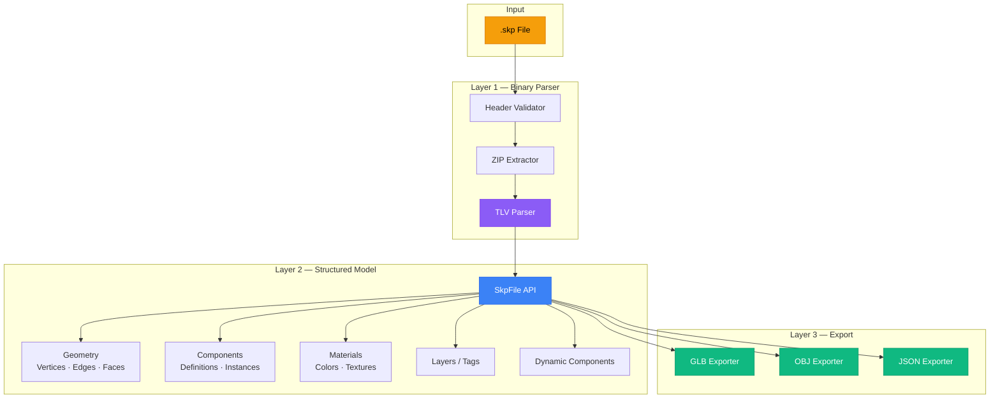

<div align="center">

# 🏗️ OpenSKP

### The Open-Source SketchUp File Parser

**Parse `.skp` files without SketchUp. No SDK. No license. Just code.**

### 🌐 [Try the Live Web Viewer (Drag-and-Drop)](https://iamahsanmehmood.github.io/openskp/)

[](https://opensource.org/licenses/MIT)
[](https://python.org)
[](https://www.npmjs.com/package/openskp)
[](https://www.nuget.org/packages/OpenSkp)
[](https://github.com/iamahsanmehmood/openskp)

---

*Open-source SketchUp binary file parser for Python, TypeScript, .NET, and Dart*

[Quick Start](#-quick-start) · [Features](#-features) · [Used in Production](#-used-in-production) · [Documentation](#-documentation) · [Contributing](#-contributing)

</div>

---

## 🌟 What is OpenSKP?

OpenSKP is the **first and only** open-source, cross-platform parser for SketchUp (`.skp`) binary files. Built entirely through reverse engineering of the proprietary **VFF binary format** used in SketchUp 2021+, it gives you full programmatic access to 3D models — geometry, materials, components, layers, and more — without requiring the SketchUp application or its proprietary SDK.

> [!IMPORTANT]
> This project was built by reverse engineering a proprietary binary format. It is not affiliated with or endorsed by Trimble Inc. or SketchUp.

---

## ✨ Features

| Feature | Status | Description |
|:--------|:------:|:------------|
| **Parse SKP 2021+** | ✅ | Full support for VFF (SketchUp 2021+) binary format |
| **3D Geometry Extraction** | ✅ | Vertices, edges, faces, normals, and UV coordinates |
| **Component Hierarchy** | ✅ | Nested component definitions and instance transforms |
| **Layers / Tags** | ✅ | Layer definitions with colors and visibility state |
| **Materials & Textures** | ✅ | Material properties, colors, and embedded texture images |
| **Dynamic Components** | ✅ | Extract dynamic component attribute key-value pairs |
| **Export to GLB** | ✅ | Industry-standard glTF Binary export with full scene graph |
| **Export to OBJ** | ✅ | Wavefront OBJ with MTL material support |
| **Export to JSON** | ✅ | Complete model data as structured JSON |
| **Pure Implementation** | ✅ | No SketchUp SDK, no native dependencies, no license required |
| **Cross-Platform** | ✅ | Works on Linux, macOS, and Windows |

---

## 🏭 Used in Production

OpenSKP isn't just a library — it's the SketchUp-parsing engine behind real, actively-used production applications:

| Project | Description | How it uses OpenSKP |
|:--------|:-------------|:---------------------|
| [FrameSmart](https://frame-smart.com/) | A 3D collaboration platform for viewing, sharing, and collaborating on 3D models together with their metadata (IFC, SketchUp, and more) — hosted on Linux, with nearly 200 active users. | Powers FrameSmart's entire SketchUp import pipeline, end to end. |
| [IngeTrazo](https://ingetrazo.com/) | A free, Linux-first 3D modeler for civil engineering and architecture — a SketchUp alternative with a BIM → IFC bridge. | Replaced IngeTrazo's Wine + proprietary SketchUp DLL dependency as its native `.skp` import backend. |

Using OpenSKP in your own project? [Open an issue](https://github.com/iamahsanmehmood/openskp/issues) or a PR to add it here.

---

## 🖥️ Platform Support

| Platform | Version | Status | Install | Package Link |
|:---------|:--------|:------:|:--------|:-------------|
| 🐍 **Python** | `v0.1.0` | ✅ Available | `pip install openskp` | [PyPI](https://pypi.org/project/openskp/) |
| 📘 **TypeScript / JS** | `v0.1.0` | ✅ Available | `npm install openskp` | [npm](https://www.npmjs.com/package/openskp) |
| 🚀 **.NET / C#** | `v0.2.0` | 🚧 In Development | `dotnet add package OpenSkp` | [NuGet](https://www.nuget.org/packages/OpenSkp) |
| 🎯 **Dart / Flutter** | `v0.1.0` | 🗓️ Bootstrapping | `dart pub add openskp` | [pub.dev](https://pub.dev/packages/openskp) |

---

## 🚀 Quick Start

### Installation

```bash
pip install openskp
```

### Parse a SketchUp File

```python
from openskp import SkpFile

# Open and parse an SKP file
model = SkpFile.open("my_model.skp")

# Access geometry
for face in model.faces:
    print(f"Face with {len(face.vertices)} vertices")
    for vertex in face.vertices:
        print(f"  ({vertex.x:.2f}, {vertex.y:.2f}, {vertex.z:.2f})")

# Access components
for component in model.components:
    print(f"Component: {component.name}")
    for instance in component.instances:
        print(f"  Instance at {instance.transform.origin}")
```

### Export to GLB

```python
from openskp import SkpFile

model = SkpFile.open("my_model.skp")

# Export the entire model to glTF Binary
model.export_glb("output.glb")
```

### Export to OBJ

```python
from openskp import SkpFile

model = SkpFile.open("my_model.skp")

# Export as Wavefront OBJ with materials
model.export_obj("output.obj")
```

### Extract Layers and Materials

```python
from openskp import SkpFile

model = SkpFile.open("my_model.skp")

# List all layers/tags
for layer in model.layers:
    print(f"Layer: {layer.name} | Color: {layer.color} | Visible: {layer.visible}")

# List all materials
for material in model.materials:
    print(f"Material: {material.name}")
    if material.texture:
        material.texture.save(f"textures/{material.name}.png")
```

### Low-Level Binary Access

```python
from openskp.binary import VffReader

# Parse the raw TLV stream for custom analysis
reader = VffReader("my_model.skp")
for tag, length, data in reader.iter_tlv():
    print(f"Tag: 0x{tag:04X} | Length: {length} bytes")
```

---

## 🏛️ Architecture

OpenSKP uses a **three-layer architecture** that separates binary parsing from high-level model access and export:



> 📖 For a detailed architecture breakdown, see [docs/ARCHITECTURE.md](docs/ARCHITECTURE.md).

---

## 📁 Project Structure

```
openskp/
├── README.md                  # You are here
├── LICENSE                    # MIT License
├── CONTRIBUTING.md            # Contribution guide
├── CODE_OF_CONDUCT.md         # Contributor Covenant v2.1
├── CHANGELOG.md               # Release history
│
├── python/                    # 🐍 Python implementation
│   ├── openskp/
│   │   ├── __init__.py
│   │   ├── skp_file.py        # High-level API (Layer 2)
│   │   ├── binary/            # Binary parser (Layer 1)
│   │   │   ├── vff_reader.py  # VFF container reader
│   │   │   ├── tlv_parser.py  # Tag-Length-Value parser
│   │   │   └── tags.py        # Known tag definitions
│   │   ├── model/             # Structured model objects
│   │   │   ├── geometry.py    # Vertex, Edge, Face
│   │   │   ├── component.py   # ComponentDef, Instance
│   │   │   ├── material.py    # Material, Texture
│   │   │   └── layer.py       # Layer / Tag
│   │   └── export/            # Export engines (Layer 3)
│   │       ├── glb.py
│   │       ├── obj.py
│   │       └── json.py
│   ├── tests/
│   ├── setup.py
│   └── pyproject.toml
│
├── typescript/                # 📘 TypeScript implementation (coming)
├── dart/                      # 🎯 Dart implementation (planned)
│
├── docs/                      # 📖 Documentation
│   ├── BINARY_FORMAT.md       # Reverse-engineered SKP format spec
│   ├── ARCHITECTURE.md        # Library architecture
│   └── API_DESIGN.md          # Cross-platform API contract
│
├── research/                  # 🔬 Research notes
│   └── METHODOLOGY.md         # Reverse engineering methodology
│
└── .github/                   # GitHub configuration
    ├── PULL_REQUEST_TEMPLATE.md
    └── ISSUE_TEMPLATE/
        ├── bug_report.md
        └── feature_request.md
```

---

## 🔬 How It Works

SketchUp `.skp` files use a proprietary binary format called **VFF** (introduced in SketchUp 2021). Here's how OpenSKP reads them:

### 1. Header Validation
Every SKP file starts with a magic marker (`FF FE FF 0E`) followed by a UTF-16LE version string. OpenSKP validates this header to confirm format compatibility.

### 2. ZIP Extraction
The SKP file is a ZIP archive (following the header). Inside, you'll find:
- **`model.dat`** — The binary geometry payload (TLV-encoded)
- **`materials/*/material.xml`** — Material definitions and textures
- **`meta/*.png`** — Thumbnails and preview images

### 3. TLV Parsing
The `model.dat` binary uses **Tag-Length-Value (TLV)** encoding:
- **Tag**: 2-byte identifier (little-endian)
- **Length**: 4-byte payload size (little-endian)
- **Value**: Raw bytes of the specified length

Some tags are *containers* — their payload is a sequence of nested TLV elements, forming a tree structure.

### 4. Model Construction
OpenSKP maps known tags to geometry primitives, component hierarchies, layers, and materials to build a structured, queryable model object.

### 5. Coordinate Conversion
SketchUp uses a **Z-up, inches** coordinate system. When exporting to glTF (which uses Y-up, meters), OpenSKP applies:

```
x_mm =  x_inches × 25.4
y_mm =  z_inches × 25.4
z_mm = -y_inches × 25.4
```

> 📖 For the full binary format specification, see [docs/BINARY_FORMAT.md](docs/BINARY_FORMAT.md).

---

## 📖 Documentation

| Document | Description |
|:---------|:------------|
| [Binary Format Spec](docs/BINARY_FORMAT.md) | Reverse-engineered VFF / TLV format documentation |
| [Architecture](docs/ARCHITECTURE.md) | Library design, layers, and module structure |
| [API Design](docs/API_DESIGN.md) | Cross-platform API contract with examples |
| [Research Methodology](research/METHODOLOGY.md) | How we reverse-engineered the format |
| [Changelog](CHANGELOG.md) | Version history and release notes |
| [Contributing](CONTRIBUTING.md) | How to contribute to OpenSKP |

---

## 🤝 Contributing

We welcome contributions from everyone! Whether it's fixing a bug, adding a feature, improving documentation, or implementing a new platform — every contribution matters.

```bash
# Clone the repository
git clone https://github.com/iamahsanmehmood/openskp.git
cd openskp

# Set up development environment (Python)
cd python
python -m venv .venv
source .venv/bin/activate   # or .venv\Scripts\activate on Windows
pip install -e ".[dev]"

# Run tests
pytest
```

Please read our [Contributing Guide](CONTRIBUTING.md) and [Code of Conduct](CODE_OF_CONDUCT.md) before submitting a pull request.

---

## 📄 License

OpenSKP is released under the [MIT License](LICENSE). You are free to use, modify, and distribute this software in both commercial and non-commercial projects.

---

## 🙏 Credits & Acknowledgements

**Created and maintained by [Ahsan Mehmood](https://github.com/iamahsanmehmood)**

This project would not be possible without:

- [Noor Ali Qureshi](https://github.com/nooraliqureshi) — SketchUp 2025 support, older SKP version fixes, materials rendering support, and the TypeScript UTF-8 decoding fix.
- [Marco Sumari](https://github.com/tuxiasumari) — material fidelity (textures, colourized materials, instance and back-side materials, per-face UV mapping), Image entities, styles, edge display flags, and full legacy MFC (SketchUp v8–v20) format support.
- The open-source community for inspiration and feedback
- [Kaitai Struct](https://kaitai.io/) for binary format analysis patterns
- [glTF](https://www.khronos.org/gltf/) specification by Khronos Group
- Everyone who has contributed test files, bug reports, and code

---

<div align="center">

**⭐ If OpenSKP is useful to you, consider giving it a star on [GitHub](https://github.com/iamahsanmehmood/openskp)!**

Made with ❤️ by [Ahsan Mehmood](https://github.com/iamahsanmehmood)

</div>
