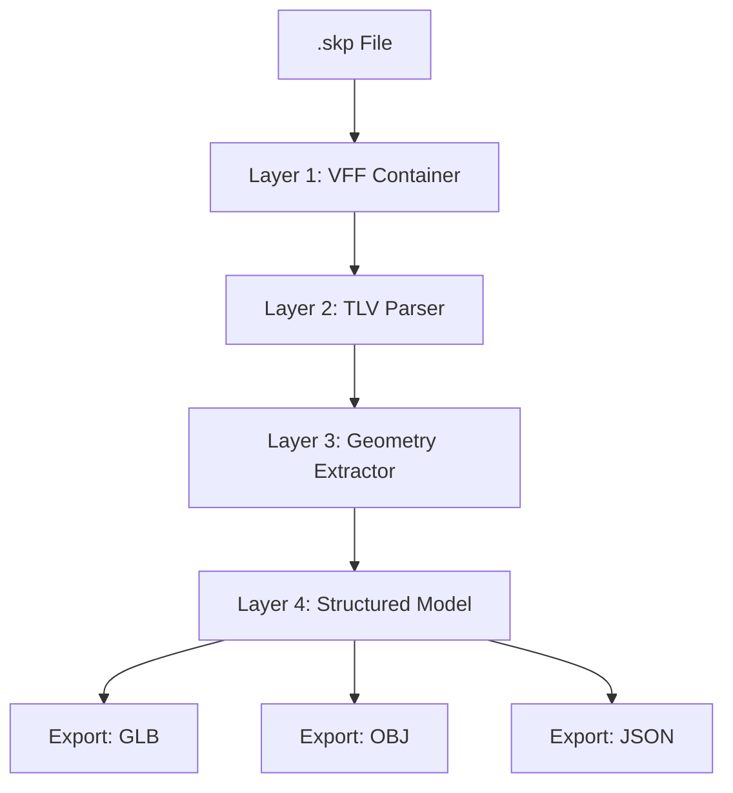
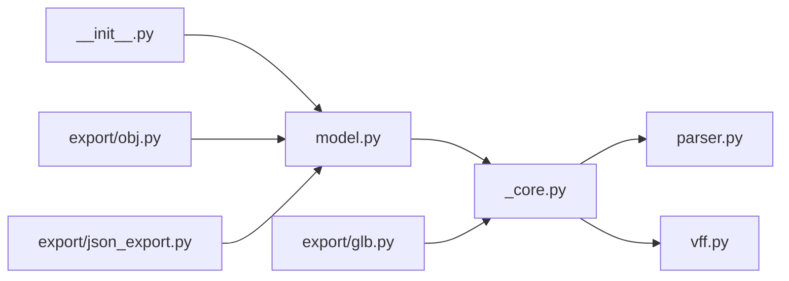

# Architecture

## Design Principles

1. **Single Source of Truth** — One reverse-engineered specification, multiple platform implementations
2. **Zero SketchUp SDK** — Pure implementation, no proprietary dependencies
3. **Layered API** — Raw → Structured → Export, each level independently useful
4. **Cross-Platform Contract** — Consistent API semantics across Python, TypeScript, and Dart

## API Layers

### Layer 1 — VFF Container (`vff.py`)
Validates the binary header, locates the embedded ZIP, and extracts `model.dat` and material XMLs.

### Layer 2 — TLV Parser (`parser.py`)
Generic binary parser that reads Tag-Length-Value elements recursively. Container tags descend into children; leaf tags return raw payloads.

### Layer 3 — Geometry Extractor (`_core.py` / `geometry.py`)
Walks the TLV tree to extract vertices (C409), edges (B80B), faces (AC0D), and component instances (6419). Builds the definition-instance hierarchy.

### Layer 4 — Structured Model (`model.py`)
Clean dataclasses: `SkpModel`, `Definition`, `Vertex`, `Edge`, `Face`, `Layer`, `Material`, `Instance`. Platform-agnostic representation.

## Module Dependency Graph

## Cross-Platform Strategy

| Component | Python | TypeScript | Dart |
|-----------|--------|------------|------|
| VFF extraction | `zipfile` | `fflate` | `dart:io` |
| TLV parsing | `struct` | `DataView` | `ByteData` |
| Triangulation | `shapely` | `earcut` | `earcut_dart` |
| GLB export | `trimesh` | custom | custom |
| Matrix math | `numpy` | native | `vector_math` |

Each platform reads the same binary format and produces the same structured output. The `docs/BINARY_FORMAT.md` is the canonical reference.
