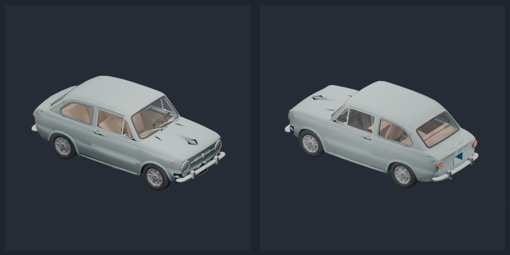

# C++ GLB export validation

These Blender renders were produced from GLBs written by the C++
`openskp_export_glb` example. They are not direct renders of the source SKP
files.

| Source model | GLB size | Primitives | Vertices | Triangles | Khronos validator |
| --- | ---: | ---: | ---: | ---: | --- |
| [Airplane military](https://3dwarehouse.sketchup.com/model/a56ad8b0-e318-4c11-b37d-dcf5ae058d04/Airplane-military) | 12.89 MiB | 291 | 307,509 | 495,720 | 0 errors, warnings, infos, or hints |
| [Old car](https://3dwarehouse.sketchup.com/model/87880d9f-6459-415a-b1a5-2ac8cd49e028/Old-car) | 8.27 MiB | 562 | 199,708 | 294,006 | 0 errors, warnings, infos, or hints |

Validation used the Release C++ exporter, Khronos glTF Validator
`2.0.0-dev.3.10`, and Blender 5.2. Both GLBs imported with finite bounds and
rendered without importer errors. The car was rendered from both sides to
exercise mirrored component transforms and distinct SketchUp front/back
materials.

```console
openskp_export_glb source.skp output.glb
blender --factory-startup --background --python render.py -- output.glb output.png stats.json
```

## Airplane military


## Old car — both sides


